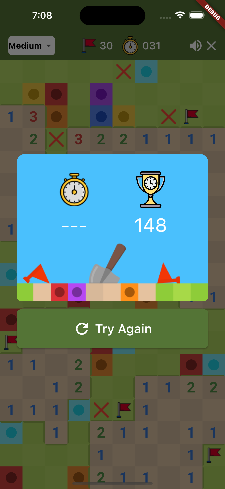

# Minesweeper Game App

This is a simple Minesweeper game app developed using Flutter/Dart technologies. It features 3 difficulty settings, sound effects, and a statistics page to keep track progress. The game is implemented using the Provider package for state management and developed with **MVC** (_Model-View-Controller_) software architecture.

## Installation

To use this app, simply clone the project and run it in your preferred IDE. No additional installation is required.

## Usage

To start a new game, click New game button and the game board will be generated automatically. You can choose a difficulty level for different sizes of game board and mine counts. To play, tap on any of the cells on the board to reveal what's underneath. If you reveal a bomb, the game is over. If you reveal a number, it indicates how many bombs are adjacent to that cell. Use this information to avoid the bombs and uncover the entire board to win the game.

To mark a cell that you think contains a mine, you can hold down on the cell to place or remove a flag. There are as many flags as mines in the game, and you can use them to keep track of where you think the mines are.

## Features

- 3 difficulty settings
- Sound effects
- Timer that starts when the game begins
- Flags for marking cells that contain mines
- Board size changes based on difficulty setting
- Gameplay metrics tracking

## Technologies Used

- [**Flutter**](https://flutter.dev)
- [**Dart**](https://dart.dev)
- [**Provider**](https://pub.dev/packages/provider)  package for state management
- [**just_audio**](https://pub.dev/packages/just_audio) package for playing sounds
- [**shared_preferences**](https://pub.dev/packages/shared_preferences) package for saving high scores
- [**google_fonts**](https://pub.dev/packages/google_fonts) package for font styles

## Screenshots
HomeView |Gameplay |Gameplay |Statistics
:-:|:-:|:-:|:-:
 |  |  | 

## Preview

https://user-images.githubusercontent.com/83721234/227311414-8494b690-8cb6-4a28-9e3f-d068b2fd4f25.mp4

## Roadmap

- Add more sound effects and music options
- Add the ability to customize game settings
- Implement a leaderboard for tracking high scores

## Contributing

As this project was made by only one person, there is no team to contribute to it. However, feel free to fork the project and make your own changes or improvements.

## Credits

Created by [@recepsenoglu](https://github.com/recepsenoglu) - feel free to contact me!

## License

This project is licensed under the MIT License - see the [LICENSE.md](https://github.com/recepsenoglu/minesweeper/blob/main/LICENSE) file for details.
